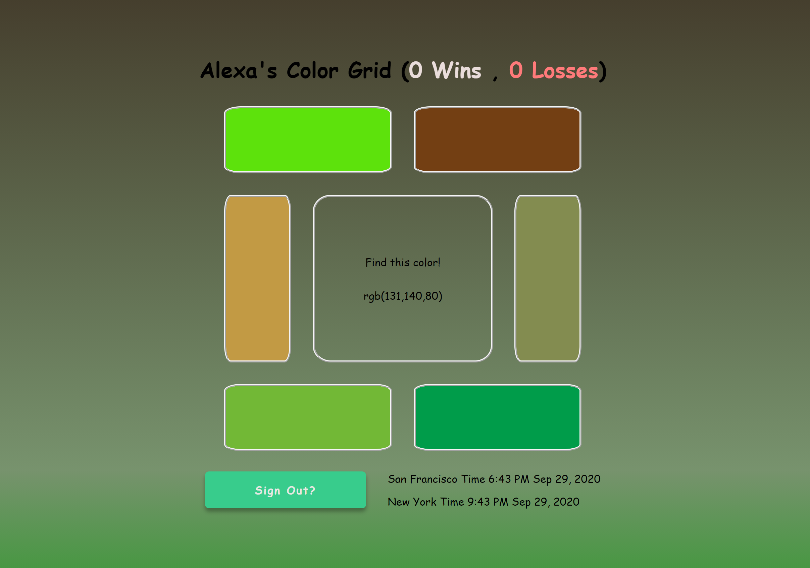

# Color Carnival Summary

## How to play
To try out my version of Color Carnival open up your terminal and navigate to `YOUR_PATH/color-carnvial-emeke/color-carnival-server` and run command `npm start` to start the server on `localhost://3001`.
Open up your favorite browser and head to `localhost//3001` and you'll be able to sign in with one of the mock accounts in `mockUsers.js` ex. `Username: Alexa, Password: abc`. Play the game as much you want and if you sign out your win / loss record is preserved while server is running.
    
## Discussion
To begin I used my own boilerplate to set up Parcel to bundle the code and build the front-end. I use express on node server to make it easier to handle routing and serve up front end files. The front end project uses React & React Router to handle navigation in the single page app. 

The frontend has a view for `Login` and `ColorGame`. When a user signs in using an account found in `mockUsers.js` the backend will perform a fake authorization and if successful the front end will set `isAunthenticated: true` in local storage. The user can now play the game as much as they want and on each selection of a color the frontend determines correctness and then posts to the backend. Backend will update users win/loss and then respond with a new game and let the user try again. We can also logout and sign in as a differnt user.

The backend contains routes for sign in, sign out, getting a game, posting a choice and updating a users wins/losses, getting the date in NYC and SFO, and getting user info. We generate games in `game.js`. Using `date-fns` and JavaScript `Date` we can use `date.js` to format dates correctly.   

## Tradoffs
It would've been great to set up React Router to use [Static Router](https://reactrouter.com/web/api/StaticRouter) so that we can use server side rendering to serve up our react code. If a user visits `/game` not logged in they'll be automatically redirected to `/` users can only view `/game` if they're authenticated on client. Although the backend is functional it would be good to break it up into more routes to have it be more modular, but the current server is simple enough to parse.

## Dependencies
- [Parcel](https://parceljs.org/getting_started.html) I use Parcel for bundling since it's easier to configure than webpack and not as bloated as Create-react-app
- [Express](https://expressjs.com/en/guide/routing.html) Express to make setting up routes and middleware in NodeJS easier
- [nodemon](https://nodemon.io/) auto reload server changes
- [React](https://reactjs.org/) Everybody's favorite front-end framework
- [React Router](https://reactrouter.com/web/example/basic) Provides support for client side routing
- [date-fns](https://date-fns.org/) Lightweight and easy to use library for formatting dates using built in JS Date Object. Moment is being deprecated and has a large bundle size so date-fns is a good alternative.
- [date-fns-tz](https://github.com/marnusw/date-fns-tz#utctozonedtime) Utility library to help date-fns format time zones

## The End
Hope you enjoy!

